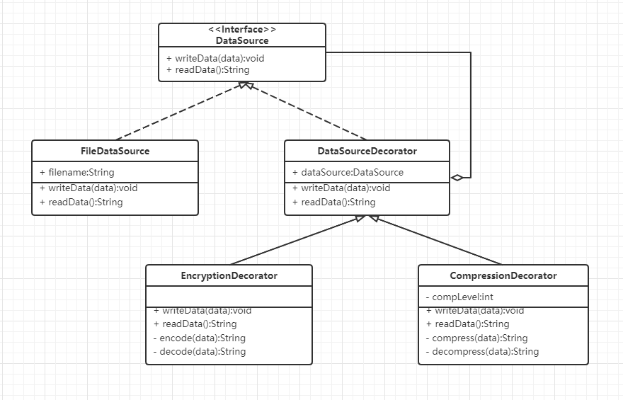

## 装饰者模式

-  部件 （Component） 声明封装器和被封装对象的公用接口。
-  具体部件 （Concrete Component） 类是被封装对象所属的类。 它定义了基础行为， 但装饰类可以改变这些行为。
-  基础装饰 （Base Decorator） 类拥有一个指向被封装对象的引用成员变量。 该变量的类型应当被声明为通用部件接口， 这样它就可以引用具体的部件和装饰。 装饰基类会将所有操作委派给被封装的对象。
-  具体装饰类 （Concrete Decorators） 定义了可动态添加到部件的额外行为。 具体装饰类会重写装饰基类的方法， 并在调用父类方法之前或之后进行额外的行为。

## Demo

1. 当数据即将被写入磁盘前， 装饰对数据进行加密和压缩。 在原始类对改变毫无察觉的情况下， 将加密后的受保护数据写入文件

2. 当数据刚从磁盘读出后， 同样通过装饰对数据进行解压和解密。

- DataSource 部件 
- FileDataSource 具体部件（基本的文件读取写入功能）
- DataSourceDecorator 基础装饰(方法转发类)
- EncryptionDecorator 具体装饰类(加解密类)
- CompressionDecorator 具体装饰类(压缩解压类)
-  Test 测试类